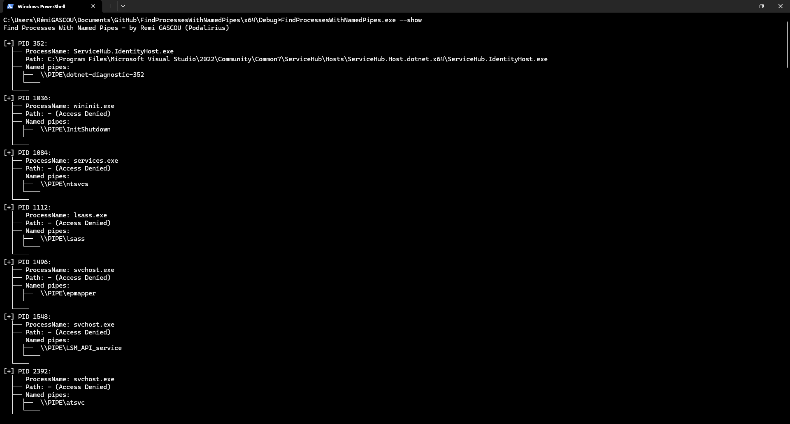

<p align="center">
  A simple C++ Windows tool to get information about processes exposing named pipes.
  <br>
  
  <a href="https://twitter.com/intent/follow?screen_name=podalirius_" title="Follow"></a>
  <a href="https://www.youtube.com/c/Podalirius_?sub_confirmation=1" title="Subscribe"></a>
  <br>
</p>

## Features

 - [x] Command line options:
   + [x] `-j` or `--json` to specify the JSON output file path.
   + [x] `-c` or `--csv` to specify the CSV output file path.
   + [x] `-h` or `--help` to display help information.
   + [x] `-v` or `--verbose` to enable verbose output.

 - [x] Output formats:
   + [x] JSON output with process details and named pipes
   + [x] CSV output with process ID, name, path and pipes
   + [x] Text output with process ID, name, path and pipes

## Usage

```
C:\> FindProcessesWithNamedPipes.exe -h
Find Processes With Named Pipes - by Remi GASCOU (Podalirius)

Usage: FindProcessesWithNamedPipes.exe [-c csv] [-d debug] [-h help] [-j json] [-s show] [-t text]

Optional arguments:
   -h, --help Displays this help message. (default: false)
   -j, --json Output results in JSON format (default: )
   -c, --csv Output results in CSV format (default: )
   -t, --text Output results in plain text format (default) (default: )
   -s, --show Print the results. (default: false)
   -d, --debug Enable debug logging (default: false)
```

## Demonstration



## Contributing

Pull requests are welcome. Feel free to open an issue if you want to add other features.
